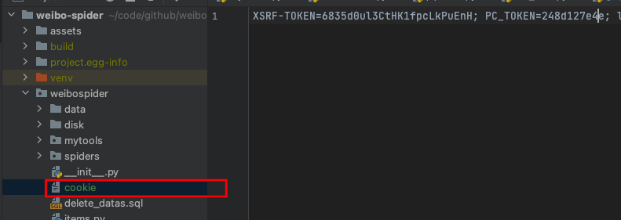

# weibo-spider

### 目标数据格式

源微博


转发微博


用户信息


### 主要爬虫的爬取步骤

爬虫汇总到TotalWeiboHotSearchSpider中，主要分四部分，这四部分的代码都在TotalWeiboHotSearchSpider中


### 使用Mysql管理的原因

> 高频读写 文件读写容易出错和冗余 且需要的量比较大
>
> 当然也可以不用mysql，pipelines.py中定义了最后数据存储的流向，需要其他格式的参照官网处理。

### 环境配置与运行

1. cookie(有效期在一天左右 所以需要每天更新重新启动)

   

   

   网页版登陆后，拿到cookie，并写进weibospider/cookie

2. Mysql配置

   本地安装一个Mysql数据库，然后新建一个名为weibo_datas的database专门存放微博数据。建立表的sql文件在项目的weibo_datas.sql里面，在`use weibo_datas;`后执行`source path/weibo_datas.sql`建表即可。

   完成数据库设置后，然后找到weibospider/private_setting.py文件，填入以下内容

   ```bash
   # 数据库账号密码
   MYSQL_HOST = '127.0.0.1'
   MYSQL_DATABASE = 'weibo_datas'
   MYSQL_USERNAME = 'root'
   MYSQL_PASSWORD = 'xxxxxx'
   MYSQL_PORT = '3306'
   
   # 快代理账号密码（非必需 参照代理文档 以金钱换时间）
   PROXY_USERNAME = "xxxx"
   PROXY_PASSWORD = "xxxx"
   ```

3. 运行爬虫

   ```bash
   cd weibo-spider
   pip install -r requirements.txt # 安装环境
   scrapy list # 列出爬虫
   scrapy crawl user_info # 爬取50条用户数据测试一下
   scrapy crawl total_weibo # 爬取一轮热搜下的传播数据 包含源微博、转发微博、用户信息
   ```


### 注意点

   * total_weibo会爬取一轮微博热搜的传播数据，没用隧道代理前爬的比较慢，一轮下来要6个小时左右，数据量在10w左右，而且爬取用户那个接口容易被反爬频率，反爬失效则需要重新更新cookie。

   * 如果使用隧道代理（需要花钱），则会快且稳定，一轮在1个半小时左右能跑完，结合cookie有效期在一天左右，weibospider/timing_script脚本能够设置爬取轮数(5-8轮比较合适)。这样每天的任务就是更新cookie+启动timing_script脚本

     ```bash
     python timing_script.py
     ```

   * settings.py里有很多全局设置，其中比较重要的是

     ```bash
     DOWNLOAD_DELAY = 1 # 全局下载延迟为1秒 主要是降频防止被识别反爬 如果使用隧道代理则可以直接注释掉
     ```

   * 汇总的爬虫代码在total_weibo.py里面，可能需要维护(因为网页、接口等可能会发生变化)

     > 1. 源微博的是直接从html页面解析爬取的，里面使用的是xpath解析网页，维护需要一定的知识背景，配合[xpath helper插件](https://chrome.google.com/webstore/detail/xpath-helper/hgimnogjllphhhkhlmebbmlgjoejdpjl)使用，这个页面无需cookie访问
     >
     >    
     >
     > 2. 转发微博从`https://weibo.com/ajax/statuses/repostTimeline`这个ajax接口获取，无需cookie访问
     >
     > 3. 用户信息从`https://weibo.com/ajax/profile/info?uid=xxxx`这个ajax接口获取，注意这个接口是需要cookie才能访问的


### 代理池服务：大幅度提升爬取速率，以金钱换时间

需要用到快代理服务(或者其他代理服务)，快代理集成文档如下: https://www.kuaidaili.com/doc/dev/sdk_tps_http/#proxy_python-scrapy 400RMB/Month

### 免责声明

一切下载及使用软件(weibo-spider)时均被视为已经仔细阅读并完全同意以下条款：

- 软件(weibo-spider)仅供个人学习与交流使用，严禁用于商业以及不良用途。
- 如有发现任何商业行为以及不良用途，软件(weibo-spider)作者有权撤销使用权。
- 使用本软件所存在的风险将完全由其本人承担，软件(weibo-spider)作者不承担任何责任。
- 软件(weibo-spider)注明之服务条款外，其它因不当使用本软件而导致的任何意外、疏忽、合约毁坏、诽谤、版权或其他知识产权侵犯及其所造成的任何损失，本软件作者概不负责，亦不承担任何法律责任。
- 对于因不可抗力或因黑客攻击、通讯线路中断等不能控制的原因造成的服务中断或其他缺陷，导致用户不能正常使用，软件(weibo-spider)作者不承担任何责任，但将尽力减少因此给用户造成的损失或影响。
- 本声明未涉及的问题请参见国家有关法律法规，当本声明与国家有关法律法规冲突时，以国家法律法规为准。 
- 本软件相关声明版权及其修改权、更新权和最终解释权均属软件(weibo-spider)作者所有。